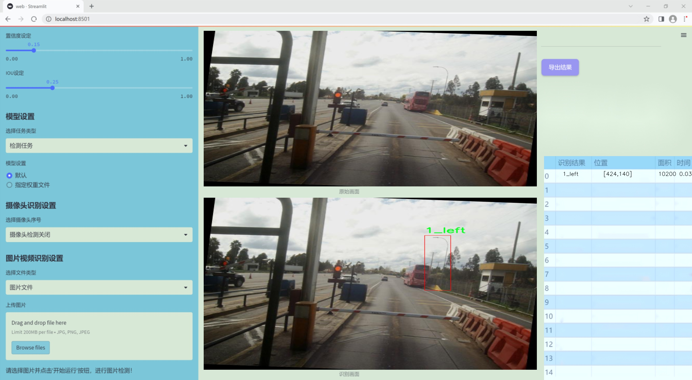
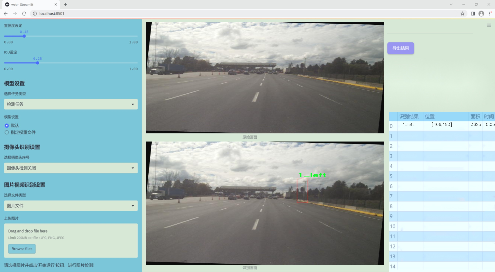
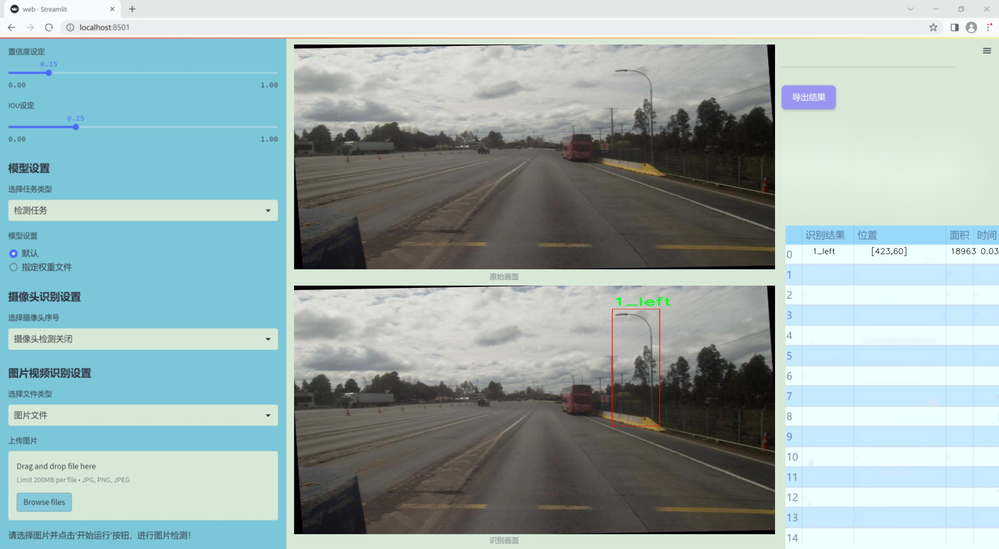
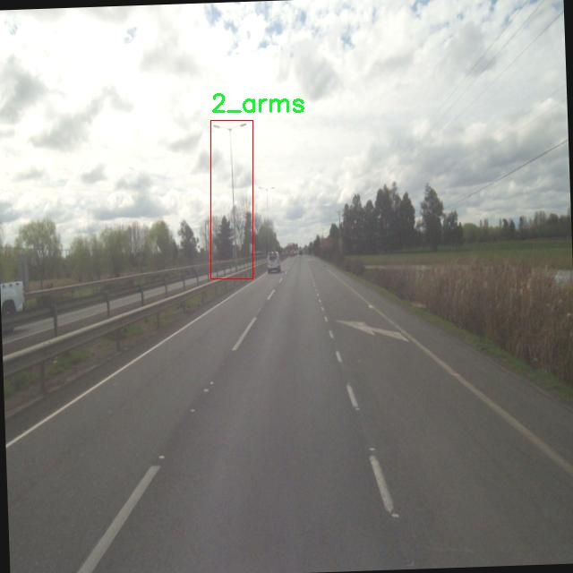
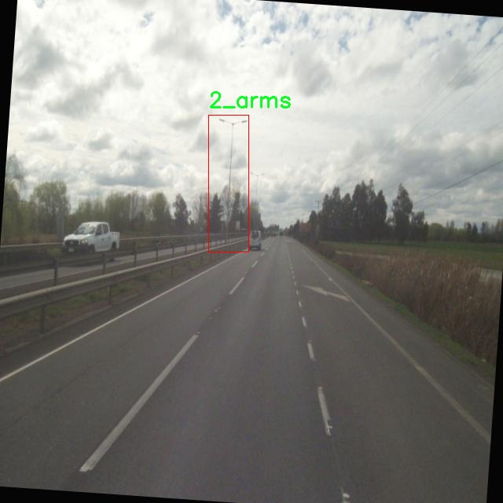
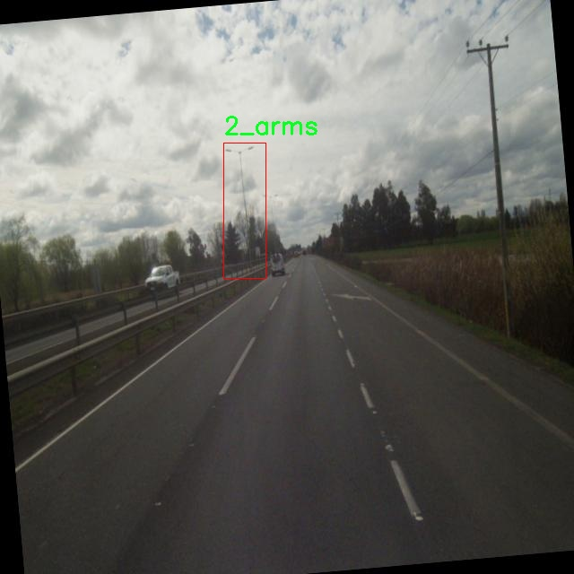
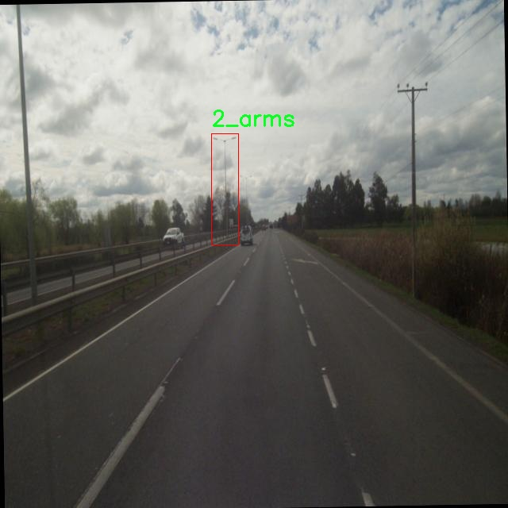
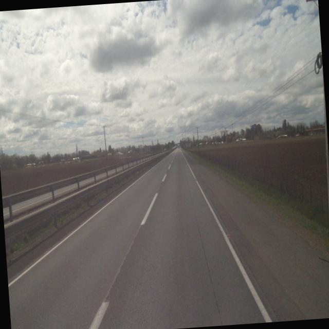

# 改进yolo11-attention等200+全套创新点大全：交通灯检测系统源码＆数据集全套

### 1.图片效果展示







##### 项目来源 **[人工智能促进会 2024.11.03](https://kdocs.cn/l/cszuIiCKVNis)**

注意：由于项目一直在更新迭代，上面“1.图片效果展示”和“2.视频效果展示”展示的系统图片或者视频可能为老版本，新版本在老版本的基础上升级如下：（实际效果以升级的新版本为准）

  （1）适配了YOLOV11的“目标检测”模型和“实例分割”模型，通过加载相应的权重（.pt）文件即可自适应加载模型。

  （2）支持“图片识别”、“视频识别”、“摄像头实时识别”三种识别模式。

  （3）支持“图片识别”、“视频识别”、“摄像头实时识别”三种识别结果保存导出，解决手动导出（容易卡顿出现爆内存）存在的问题，识别完自动保存结果并导出到tempDir中。

  （4）支持Web前端系统中的标题、背景图等自定义修改。

  另外本项目提供训练的数据集和训练教程,暂不提供权重文件（best.pt）,需要您按照教程进行训练后实现图片演示和Web前端界面演示的效果。

### 2.视频效果展示

[2.1 视频效果展示](https://www.bilibili.com/video/BV1ecDHYJEwj/)

### 3.背景

研究背景与意义

随着城市化进程的加快，交通管理面临着前所未有的挑战。交通灯作为城市交通控制的重要组成部分，其准确识别与实时监测对于提高交通效率、保障行车安全具有重要意义。传统的交通灯检测方法往往依赖于人工监控或简单的图像处理技术，难以适应复杂多变的交通环境，尤其是在光照变化、天气条件不佳以及交通流量大的情况下，检测的准确性和实时性均受到影响。因此，开发一种高效、准确的交通灯检测系统显得尤为重要。

本研究基于改进的YOLOv11模型，旨在提升交通灯的检测精度和速度。YOLO（You Only Look Once）系列模型以其快速的检测速度和较高的准确率在目标检测领域取得了显著的成果。通过对YOLOv11进行改进，结合特定的交通灯数据集，我们希望能够实现对交通灯的精准识别和分类。该数据集包含2400张图像，涵盖了交通灯的不同状态和角度，具体类别包括左侧信号灯、右侧信号灯和双臂信号灯，能够有效地反映出交通灯在实际应用中的多样性。

本研究的意义不仅在于提升交通灯的检测技术，更在于为智能交通系统的建设提供技术支持。通过高效的交通灯检测系统，可以实现对交通流量的实时监控与调控，进而减少交通拥堵、降低事故发生率。此外，该系统的应用还可以为自动驾驶技术的发展提供重要的数据支撑，推动智能交通的进一步发展。因此，基于改进YOLOv11的交通灯检测系统的研究具有重要的理论价值和广泛的应用前景。

### 4.数据集信息展示

##### 4.1 本项目数据集详细数据（类别数＆类别名）

nc: 3
names: ['1_left', '1_right', '2_arms']


该项目为【目标检测】数据集，请在【训练教程和Web端加载模型教程（第三步）】这一步的时候按照【目标检测】部分的教程来训练

##### 4.2 本项目数据集信息介绍

本项目数据集信息介绍

本项目所使用的数据集名为“Thesis”，旨在为改进YOLOv11的交通灯检测系统提供强有力的支持。该数据集专注于交通信号灯的不同类型，包含三种主要类别，分别为“1_left”、“1_right”和“2_arms”。这些类别的划分不仅反映了交通信号灯的多样性，也为模型的训练提供了丰富的样本，以便其能够在实际应用中准确识别和分类不同类型的交通信号灯。

“Thesis”数据集的构建经过精心设计，确保了数据的多样性和代表性。每个类别的样本均来自于不同的城市环境和交通条件，涵盖了各种光照和天气情况。这种多样性使得模型在训练过程中能够学习到不同场景下交通信号灯的特征，从而提高其在真实世界应用中的鲁棒性和准确性。此外，数据集中还包含了不同角度和距离下拍摄的交通信号灯图像，进一步增强了模型的泛化能力。

为了确保数据集的高质量和有效性，所有图像均经过标注，标注信息包括交通信号灯的类别和位置。这些标注将为YOLOv11模型的训练提供必要的监督信号，使其能够更好地学习到特征并进行精确的检测。通过使用“Thesis”数据集，我们期望能够显著提升YOLOv11在交通灯检测任务中的性能，进而推动智能交通系统的发展与应用。整体而言，“Thesis”数据集不仅为本项目提供了坚实的数据基础，也为未来相关研究提供了宝贵的参考资源。











### 5.全套项目环境部署视频教程（零基础手把手教学）

[5.1 所需软件PyCharm和Anaconda安装教程（第一步）](https://www.bilibili.com/video/BV1BoC1YCEKi/?spm_id_from=333.999.0.0&vd_source=bc9aec86d164b67a7004b996143742dc)


[5.2 安装Python虚拟环境创建和依赖库安装视频教程（第二步）](https://www.bilibili.com/video/BV1ZoC1YCEBw?spm_id_from=333.788.videopod.sections&vd_source=bc9aec86d164b67a7004b996143742dc)

### 6.改进YOLOv11训练教程和Web_UI前端加载模型教程（零基础手把手教学）

[6.1 改进YOLOv11训练教程和Web_UI前端加载模型教程（第三步）](https://www.bilibili.com/video/BV1BoC1YCEhR?spm_id_from=333.788.videopod.sections&vd_source=bc9aec86d164b67a7004b996143742dc)


按照上面的训练视频教程链接加载项目提供的数据集，运行train.py即可开始训练



     Epoch   gpu_mem       box       obj       cls    labels  img_size
     1/200     20.8G   0.01576   0.01955  0.007536        22      1280: 100%|██████████| 849/849 [14:42<00:00,  1.04s/it]
               Class     Images     Labels          P          R     mAP@.5 mAP@.5:.95: 100%|██████████| 213/213 [01:14<00:00,  2.87it/s]
                 all       3395      17314      0.994      0.957      0.0957      0.0843

     Epoch   gpu_mem       box       obj       cls    labels  img_size
     2/200     20.8G   0.01578   0.01923  0.007006        22      1280: 100%|██████████| 849/849 [14:44<00:00,  1.04s/it]
               Class     Images     Labels          P          R     mAP@.5 mAP@.5:.95: 100%|██████████| 213/213 [01:12<00:00,  2.95it/s]
                 all       3395      17314      0.996      0.956      0.0957      0.0845

     Epoch   gpu_mem       box       obj       cls    labels  img_size
     3/200     20.8G   0.01561    0.0191  0.006895        27      1280: 100%|██████████| 849/849 [10:56<00:00,  1.29it/s]
               Class     Images     Labels          P          R     mAP@.5 mAP@.5:.95: 100%|███████   | 187/213 [00:52<00:00,  4.04it/s]
                 all       3395      17314      0.996      0.957      0.0957      0.0845


###### [项目数据集下载链接](https://kdocs.cn/l/cszuIiCKVNis)

### 7.原始YOLOv11算法讲解


YOLO11 是 Ultralytics YOLO 系列的最新版本，结合了尖端的准确性、速度和效率，用于目标检测、分割、分类、定向边界框和姿态估计。与
YOLOv8 相比，它具有更少的参数和更好的结果，不难预见，YOLO11 在边缘设备上更高效、更快，将频繁出现在计算机视觉领域的最先进技术（SOTA）中。


**主要特点**

  * **增强的特征提取：**YOLO11 使用改进的主干和颈部架构来增强特征提取，以实现更精确的目标检测和复杂任务的性能。

  * **针对效率和速度优化：**精细的架构设计和优化的训练流程在保持准确性和性能之间最佳平衡的同时，提供更快的处理速度。

  * **更少的参数，更高的准确度：**YOLO11m 在 COCO 数据集上实现了比 YOLOv8m 更高的 mAP，参数减少了 22%，提高了计算效率，同时不牺牲准确度。

  * **跨环境的适应性：**YOLO11 可以无缝部署在边缘设备、云平台和配备 NVIDIA GPU 的系统上，确保最大的灵活性。

  * **支持广泛的任务范围：**YOLO11 支持各种计算机视觉任务，如目标检测、实例分割、图像分类、姿态估计和定向目标检测（OBB）。


### 8.200+种全套改进YOLOV11创新点原理讲解

#### 8.1 200+种全套改进YOLOV11创新点原理讲解大全

由于篇幅限制，每个创新点的具体原理讲解就不全部展开，具体见下列网址中的改进模块对应项目的技术原理博客网址【Blog】（创新点均为模块化搭建，原理适配YOLOv5~YOLOv11等各种版本）

[改进模块技术原理博客【Blog】网址链接](https://gitee.com/qunmasj/good)


#### 8.2 精选部分改进YOLOV11创新点原理讲解

###### 这里节选部分改进创新点展开原理讲解(完整的改进原理见上图和[改进模块技术原理博客链接](https://gitee.com/qunmasj/good)【如果此小节的图加载失败可以通过CSDN或者Github搜索该博客的标题访问原始博客，原始博客图片显示正常】
### CBAM空间注意力机制
近年来，随着深度学习研究方向的火热，注意力机制也被广泛地应用在图像识别、语音识别和自然语言处理等领域，注意力机制在深度学习任务中发挥着举足轻重的作用。注意力机制借鉴于人类的视觉系统，例如，人眼在看到一幅画面时，会倾向于关注画面中的重要信息，而忽略其他可见的信息。深度学习中的注意力机制和人类视觉的注意力机制相似，通过扫描全局数据，从大量数据中选择出需要重点关注的、对当前任务更为重要的信息，然后对这部分信息分配更多的注意力资源，从这些信息中获取更多所需要的细节信息，而抑制其他无用的信息。而在深度学习中，则具体表现为给感兴趣的区域更高的权重，经过网络的学习和调整，得到最优的权重分配，形成网络模型的注意力，使网络拥有更强的学习能力，加快网络的收敛速度。
注意力机制通常可分为软注意力机制和硬注意力机制[4-5]。软注意力机制在选择信息时，不是从输入的信息中只选择1个，而会用到所有输入信息，只是各个信息对应的权重分配不同，然后输入网络模型进行计算;硬注意力机制则是从输入的信息中随机选取一个或者选择概率最高的信息，但是这一步骤通常是不可微的，导致硬注意力机制更难训练。因此，软注意力机制应用更为广泛，按照原理可将软注意力机制划分为:通道注意力机制（channel attention)、空间注意力机制(spatial attention）和混合域注意力机制(mixed attention)。
通道注意力机制的本质建立各个特征通道之间的重要程度，对感兴趣的通道进行重点关注，弱化不感兴趣的通道的作用;空间注意力的本质则是建模了整个空间信息的重要程度，然后对空间内感兴趣的区域进行重点关注，弱化其余非感兴趣区域的作用;混合注意力同时运用了通道注意力和空间注意力，两部分先后进行或并行，形成对通道特征和空间特征同时关注的注意力模型。

卷积层注意力模块(Convolutional Block Attention Module，CBAM）是比较常用的混合注意力模块，其先后集中了通道注意力模块和空间注意力模块，网络中加入该模块能有效提高网络性能，减少网络模型的计算量，模块结构如图所示。输入特征图首先经过分支的通道注意力模块，然后和主干的原特征图融合，得到具有通道注意力的特征图，接着经过分支的空间注意力模块，在和主干的特征图融合后，得到同时具有通道特征注意力和空间特征注意力的特征图。CBAM模块不改变输入特征图的大小，因此该模块是一个“即插即用”的模块，可以插入网络的任何位置。

通道注意力模块的结构示意图如图所示，通道注意力模块分支并行地对输入的特征图进行最大池化操作和平均池化操作，然后利用多层感知机对结果进行变换，得到应用于两个通道的变换结果，最后经过sigmoid激活函数将变换结果融合，得到具有通道注意力的通道特征图。

空间注意力模块示意图如图所示，将通道注意力模块输出的特征图作为该模块的输入特征图，首先对输入特征图进行基于通道的最大池化操作和平均池化操作，将两部分得到的结果拼接起来，然后通过卷积得到降为Ⅰ通道的特征图，最后通过sigmoid激活函数生成具有空间注意力的特征图。


### 9.系统功能展示

图9.1.系统支持检测结果表格显示

  图9.2.系统支持置信度和IOU阈值手动调节

  图9.3.系统支持自定义加载权重文件best.pt(需要你通过步骤5中训练获得)

  图9.4.系统支持摄像头实时识别

  图9.5.系统支持图片识别

  图9.6.系统支持视频识别

  图9.7.系统支持识别结果文件自动保存

  图9.8.系统支持Excel导出检测结果数据


### 10. YOLOv11核心改进源码讲解

#### 10.1 attention.py

以下是代码中最核心的部分，包含了一些重要的注意力机制模块。每个类的功能和主要方法都进行了详细的中文注释。

```python
import torch
from torch import nn
import torch.nn.functional as F

class EMA(nn.Module):
    """Exponential Moving Average (EMA) Module."""
    def __init__(self, channels, factor=8):
        super(EMA, self).__init__()
        self.groups = factor  # 将通道分成若干组
        assert channels // self.groups > 0  # 确保每组至少有一个通道
        self.softmax = nn.Softmax(-1)  # Softmax用于归一化
        self.agp = nn.AdaptiveAvgPool2d((1, 1))  # 自适应平均池化
        self.pool_h = nn.AdaptiveAvgPool2d((None, 1))  # 对高度进行池化
        self.pool_w = nn.AdaptiveAvgPool2d((1, None))  # 对宽度进行池化
        self.gn = nn.GroupNorm(channels // self.groups, channels // self.groups)  # 组归一化
        self.conv1x1 = nn.Conv2d(channels // self.groups, channels // self.groups, kernel_size=1)  # 1x1卷积
        self.conv3x3 = nn.Conv2d(channels // self.groups, channels // self.groups, kernel_size=3, padding=1)  # 3x3卷积

    def forward(self, x):
        b, c, h, w = x.size()  # 获取输入的批量大小、通道数、高度和宽度
        group_x = x.reshape(b * self.groups, -1, h, w)  # 将输入重塑为组的形式
        x_h = self.pool_h(group_x)  # 对高度进行池化
        x_w = self.pool_w(group_x).permute(0, 1, 3, 2)  # 对宽度进行池化并转置
        hw = self.conv1x1(torch.cat([x_h, x_w], dim=2))  # 将高度和宽度的池化结果拼接并通过1x1卷积
        x_h, x_w = torch.split(hw, [h, w], dim=2)  # 将结果分割回高度和宽度
        x1 = self.gn(group_x * x_h.sigmoid() * x_w.permute(0, 1, 3, 2).sigmoid())  # 通过sigmoid激活后进行组归一化
        x2 = self.conv3x3(group_x)  # 通过3x3卷积处理
        x11 = self.softmax(self.agp(x1).reshape(b * self.groups, -1, 1).permute(0, 2, 1))  # 计算x1的权重
        x12 = x2.reshape(b * self.groups, c // self.groups, -1)  # 重塑x2
        x21 = self.softmax(self.agp(x2).reshape(b * self.groups, -1, 1).permute(0, 2, 1))  # 计算x2的权重
        x22 = x1.reshape(b * self.groups, c // self.groups, -1)  # 重塑x1
        weights = (torch.matmul(x11, x12) + torch.matmul(x21, x22)).reshape(b * self.groups, 1, h, w)  # 计算最终权重
        return (group_x * weights.sigmoid()).reshape(b, c, h, w)  # 返回加权后的结果

class SimAM(nn.Module):
    """Similarity Attention Module (SimAM)."""
    def __init__(self, e_lambda=1e-4):
        super(SimAM, self).__init__()
        self.activaton = nn.Sigmoid()  # Sigmoid激活函数
        self.e_lambda = e_lambda  # 正则化参数

    def forward(self, x):
        b, c, h, w = x.size()  # 获取输入的尺寸
        n = w * h - 1  # 计算总的像素点数
        x_minus_mu_square = (x - x.mean(dim=[2, 3], keepdim=True)).pow(2)  # 计算每个像素与均值的差的平方
        y = x_minus_mu_square / (4 * (x_minus_mu_square.sum(dim=[2, 3], keepdim=True) / n + self.e_lambda)) + 0.5  # 计算y
        return x * self.activaton(y)  # 返回加权后的输入

class BiLevelRoutingAttention(nn.Module):
    """Bi-Level Routing Attention Module."""
    def __init__(self, dim, num_heads=8, n_win=7, qk_scale=None, topk=4):
        super().__init__()
        self.dim = dim  # 输入维度
        self.n_win = n_win  # 窗口数量
        self.num_heads = num_heads  # 注意力头数量
        self.qk_dim = dim // num_heads  # 每个头的维度
        self.scale = qk_scale or self.qk_dim ** -0.5  # 缩放因子
        self.router = TopkRouting(qk_dim=self.qk_dim, topk=topk)  # 路由模块
        self.qkv = QKVLinear(self.dim, self.qk_dim)  # QKV线性映射
        self.wo = nn.Linear(dim, dim)  # 输出线性映射

    def forward(self, x):
        b, c, h, w = x.size()  # 获取输入的尺寸
        q, kv = self.qkv(x)  # 计算Q和KV
        q_pix = rearrange(q, 'n p2 h w c -> n p2 (h w) c')  # 重塑Q
        kv_pix = self.kv_down(rearrange(kv, 'n p2 h w c -> (n p2) c h w'))  # 重塑KV
        kv_pix = rearrange(kv_pix, '(n j i) c h w -> n (j i) (h w) c', j=self.n_win, i=self.n_win)  # 重塑KV
        q_win, k_win = q.mean([2, 3]), kv.mean([2, 3])  # 计算窗口级别的Q和K
        r_weight, r_idx = self.router(q_win, k_win)  # 路由权重和索引
        kv_pix_sel = self.kv_gather(r_idx=r_idx, r_weight=r_weight, kv=kv_pix)  # 收集KV
        k_pix_sel, v_pix_sel = kv_pix_sel.split([self.qk_dim, self.dim], dim=-1)  # 分割K和V
        attn_weight = (q_pix * self.scale) @ k_pix_sel  # 计算注意力权重
        attn_weight = self.attn_act(attn_weight)  # 激活
        out = attn_weight @ v_pix_sel  # 计算输出
        out = self.wo(out)  # 线性映射
        return out  # 返回结果
```

以上代码展示了几个重要的注意力机制模块，包括 EMA、SimAM 和 BiLevelRoutingAttention。每个模块的构造函数和前向传播方法都进行了详细的注释，帮助理解其功能和实现逻辑。

这个文件 `attention.py` 定义了一系列与注意力机制相关的神经网络模块，主要用于计算图像特征的注意力。文件中使用了 PyTorch 框架，包含多个类和函数，每个类实现了不同类型的注意力机制或相关功能。以下是对文件内容的逐步分析。

首先，文件导入了必要的库，包括 PyTorch 的核心模块、神经网络模块、函数式接口、以及一些其他工具，如 `einops` 用于张量重排，`numpy` 用于数值计算等。

接下来，文件定义了一些常用的注意力模块。`EMA` 类实现了增强的多头注意力机制，使用了自适应平均池化和卷积操作来计算注意力权重。`SimAM` 类实现了一种基于相似度的注意力机制，使用了 Sigmoid 激活函数来调整输出。

`SpatialGroupEnhance` 类则实现了一种空间增强机制，通过对输入特征进行分组和池化，计算出增强后的特征图。`TopkRouting` 类实现了可微分的 Top-k 路由机制，用于选择最重要的特征。

`KVGather` 类用于根据路由索引和权重从键值对中选择特征。`QKVLinear` 类实现了一个线性变换，用于将输入特征映射到查询、键和值的空间。

`BiLevelRoutingAttention` 类实现了双层路由注意力机制，结合了局部和全局的注意力计算。`FocusedLinearAttention` 类则实现了一种专注的线性注意力机制，使用了卷积和注意力机制来处理输入特征。

文件中还定义了一些其他的注意力模块，如 `CoordAtt`、`TripletAttention`、`BAMBlock`、`EfficientAttention` 等，这些模块通过不同的方式来计算注意力权重，增强特征表达能力。

此外，文件中还包含了一些辅助类和函数，如 `h_sigmoid` 和 `h_swish`，用于实现特定的激活函数，`BasicConv` 用于构建基本的卷积层，`ZPool` 用于实现池化操作等。

最后，文件中定义了一些高级的注意力机制，如 `TransNeXt_AggregatedAttention` 和 `SegNext_Attention`，这些机制结合了变换器架构和注意力机制，旨在提高图像分割和特征提取的性能。

总体而言，这个文件提供了一整套灵活的注意力机制实现，适用于各种计算机视觉任务，尤其是在图像处理和特征提取方面。每个模块都可以单独使用或组合使用，以满足不同的需求。

#### 10.2 activation.py

```python
import torch
import torch.nn as nn

class AGLU(nn.Module):
    """AGLU激活函数模块，来源于https://github.com/kostas1515/AGLU。"""

    def __init__(self, device=None, dtype=None) -> None:
        """初始化AGLU激活函数模块。"""
        super().__init__()
        # 使用Softplus作为基础激活函数，beta设置为-1.0
        self.act = nn.Softplus(beta=-1.0)
        # 初始化lambda参数，并将其定义为可学习的参数
        self.lambd = nn.Parameter(nn.init.uniform_(torch.empty(1, device=device, dtype=dtype)))  # lambda参数
        # 初始化kappa参数，并将其定义为可学习的参数
        self.kappa = nn.Parameter(nn.init.uniform_(torch.empty(1, device=device, dtype=dtype)))  # kappa参数

    def forward(self, x: torch.Tensor) -> torch.Tensor:
        """计算AGLU激活函数的前向传播。"""
        # 将lambda参数限制在最小值0.0001，避免数值不稳定
        lam = torch.clamp(self.lambd, min=0.0001)
        # 计算AGLU激活函数的输出
        return torch.exp((1 / lam) * self.act((self.kappa * x) - torch.log(lam)))
```

### 代码核心部分及注释说明：

1. **类定义**：
   - `class AGLU(nn.Module)`：定义了一个名为AGLU的类，继承自PyTorch的`nn.Module`，用于实现AGLU激活函数。

2. **初始化方法**：
   - `def __init__(self, device=None, dtype=None) -> None`：构造函数，用于初始化AGLU模块。
   - `self.act = nn.Softplus(beta=-1.0)`：定义了一个Softplus激活函数，beta参数设置为-1.0。
   - `self.lambd`和`self.kappa`：这两个参数是可学习的参数，分别初始化为均匀分布的随机值。

3. **前向传播方法**：
   - `def forward(self, x: torch.Tensor) -> torch.Tensor`：定义了前向传播的方法，输入为一个张量x。
   - `lam = torch.clamp(self.lambd, min=0.0001)`：将lambda参数限制在0.0001以上，以避免在计算中出现数值不稳定的情况。
   - `return torch.exp((1 / lam) * self.act((self.kappa * x) - torch.log(lam)))`：计算AGLU激活函数的输出，使用Softplus函数和参数进行运算，最后返回结果。

这个程序文件定义了一个名为 `activation.py` 的模块，主要实现了一个统一的激活函数模块，称为 AGLU（Adaptive Gated Linear Unit）。该模块使用了 PyTorch 库，继承自 `nn.Module`，用于构建神经网络中的激活函数。

在 `AGLU` 类的初始化方法 `__init__` 中，首先调用了父类的构造函数。接着，定义了一个激活函数 `self.act`，使用了 `nn.Softplus`，其参数 `beta` 被设置为 -1.0。`Softplus` 是一种平滑的激活函数，通常用于替代 ReLU 函数。然后，定义了两个可学习的参数 `self.lambd` 和 `self.kappa`，这两个参数的初始值是通过均匀分布随机初始化的。它们的作用是在前向传播中调整激活函数的输出。

在 `forward` 方法中，定义了前向传播的计算过程。输入 `x` 是一个张量，首先对 `self.lambd` 进行限制，确保其值不小于 0.0001，以避免在后续计算中出现除以零的情况。然后，计算激活函数的输出，具体是通过 `torch.exp` 函数对一系列运算的结果进行指数运算。运算中使用了 `self.act` 和 `self.kappa`，结合了输入 `x` 和参数 `self.lambd`，实现了激活函数的非线性变换。

总体来说，这个模块提供了一种新的激活函数，旨在通过可学习的参数来增强模型的表达能力。它的设计灵感来源于 GitHub 上的相关研究，能够在深度学习模型中灵活应用。

#### 10.3 orepa.py

以下是经过简化和注释的核心代码部分，主要集中在 `OREPA` 类及其相关功能上：

```python
import torch
import torch.nn as nn
import torch.nn.init as init
import torch.nn.functional as F
import numpy as np

# OREPA类实现
class OREPA(nn.Module):
    def __init__(self, in_channels, out_channels, kernel_size=3, stride=1, padding=None, groups=1, dilation=1, act=True):
        super(OREPA, self).__init__()
        
        # 初始化参数
        self.kernel_size = kernel_size
        self.in_channels = in_channels
        self.out_channels = out_channels
        self.groups = groups
        self.stride = stride
        self.padding = padding if padding is not None else (kernel_size // 2)
        self.dilation = dilation
        
        # 激活函数
        self.nonlinear = nn.ReLU() if act else nn.Identity()
        
        # 权重参数初始化
        self.weight_orepa_origin = nn.Parameter(torch.Tensor(out_channels, in_channels // groups, kernel_size, kernel_size))
        init.kaiming_uniform_(self.weight_orepa_origin, a=math.sqrt(0.0))
        
        # 其他权重参数
        self.weight_orepa_avg_conv = nn.Parameter(torch.Tensor(out_channels, in_channels // groups, 1, 1))
        init.kaiming_uniform_(self.weight_orepa_avg_conv, a=0.0)
        
        self.vector = nn.Parameter(torch.Tensor(6, out_channels))  # 权重组合系数
        self.bn = nn.BatchNorm2d(out_channels)  # 批归一化层

        # 初始化向量
        self.init_vector()

    def init_vector(self):
        # 初始化权重组合系数
        init.constant_(self.vector[0, :], 0.25)  # origin
        init.constant_(self.vector[1, :], 0.25)  # avg
        init.constant_(self.vector[2, :], 0.0)   # prior
        init.constant_(self.vector[3, :], 0.5)   # 1x1_kxk
        init.constant_(self.vector[4, :], 0.5)   # 1x1
        init.constant_(self.vector[5, :], 0.5)   # dws_conv

    def weight_gen(self):
        # 生成组合后的权重
        weight_orepa_origin = self.weight_orepa_origin * self.vector[0, :].view(-1, 1, 1, 1)
        weight_orepa_avg = self.weight_orepa_avg_conv * self.vector[1, :].view(-1, 1, 1, 1)
        
        # 组合所有权重
        weight = weight_orepa_origin + weight_orepa_avg
        return weight

    def forward(self, inputs):
        # 前向传播
        weight = self.weight_gen()  # 生成权重
        out = F.conv2d(inputs, weight, stride=self.stride, padding=self.padding, dilation=self.dilation, groups=self.groups)
        return self.nonlinear(self.bn(out))  # 激活和归一化

    def get_equivalent_kernel_bias(self):
        # 获取等效的卷积核和偏置
        return self.weight_gen(), self.bn.bias

    def switch_to_deploy(self):
        # 切换到部署模式
        kernel, bias = self.get_equivalent_kernel_bias()
        self.orepa_reparam = nn.Conv2d(self.in_channels, self.out_channels, self.kernel_size, stride=self.stride, padding=self.padding, groups=self.groups, bias=True)
        self.orepa_reparam.weight.data = kernel
        self.orepa_reparam.bias.data = bias
        for param in self.parameters():
            param.detach_()  # 分离参数，避免梯度更新
```

### 代码注释说明：
1. **类定义**：`OREPA` 继承自 `nn.Module`，是一个自定义的卷积模块。
2. **初始化方法**：接收输入通道数、输出通道数、卷积核大小、步幅、填充、分组、扩张率和激活函数类型，初始化相关参数和权重。
3. **权重生成**：`weight_gen` 方法根据初始化的权重和向量生成最终的卷积权重。
4. **前向传播**：`forward` 方法执行卷积操作，并通过激活函数和批归一化层处理输出。
5. **等效卷积核获取**：`get_equivalent_kernel_bias` 方法返回当前模型的等效卷积核和偏置。
6. **切换到部署模式**：`switch_to_deploy` 方法用于将模型切换到推理模式，生成一个新的卷积层以便于部署。

以上是对核心部分的提炼和详细注释，保留了实现的关键逻辑和结构。

这个程序文件 `orepa.py` 是一个基于 PyTorch 的深度学习模型实现，主要涉及一种名为 OREPA（Optimized Reparameterization for Efficient Neural Networks）的网络结构。该文件定义了多个类和函数，用于构建和操作这种网络结构。

首先，文件中导入了一些必要的库，包括 PyTorch 的核心库、神经网络模块、初始化模块、功能模块以及 NumPy。接着，定义了一些辅助函数，如 `transI_fusebn` 和 `transVI_multiscale`，用于处理卷积核和批归一化的转换，以及对卷积核进行多尺度填充。

`OREPA` 类是这个文件的核心部分，继承自 `nn.Module`。在初始化方法中，类的构造函数接受多个参数，如输入通道数、输出通道数、卷积核大小、步幅、填充、分组卷积等。根据是否处于部署模式，类会选择不同的初始化方式。如果不是部署模式，则会初始化多个参数，包括不同类型的卷积核，并进行相应的权重初始化。

`OREPA` 类中还定义了多个方法，如 `fre_init`、`weight_gen` 和 `forward`。`fre_init` 方法用于初始化权重，`weight_gen` 方法生成最终的卷积权重，而 `forward` 方法则定义了前向传播的过程，使用生成的权重对输入进行卷积操作，并通过非线性激活函数和批归一化处理输出。

此外，文件中还定义了 `OREPA_LargeConv`、`ConvBN`、`OREPA_3x3_RepVGG` 和 `RepVGGBlock_OREPA` 等类，这些类扩展了 OREPA 的功能，提供了不同类型的卷积操作和网络结构。每个类都有自己的初始化方法和前向传播逻辑，适应不同的网络需求。

例如，`OREPA_LargeConv` 类实现了大卷积的结构，支持多层卷积的组合，而 `RepVGGBlock_OREPA` 类则结合了 OREPA 和 SEAttention（Squeeze-and-Excitation Attention）机制，提供了更强的特征提取能力。

最后，文件中还实现了一些用于模型部署的功能，如 `switch_to_deploy` 方法，用于将训练模式转换为推理模式，并融合卷积和批归一化的权重，以便在推理时减少计算量。

整体而言，这个文件实现了一个复杂的深度学习模块，专注于优化卷积操作和提高模型的效率，适合在计算资源有限的环境中使用。

#### 10.4 convnextv2.py

以下是代码中最核心的部分，并附上详细的中文注释：

```python
import torch
import torch.nn as nn
import torch.nn.functional as F

class LayerNorm(nn.Module):
    """ 自定义的层归一化（Layer Normalization）类，支持两种数据格式：channels_last（默认）和 channels_first。
    channels_last 对应输入形状为 (batch_size, height, width, channels)，
    而 channels_first 对应输入形状为 (batch_size, channels, height, width)。
    """
    def __init__(self, normalized_shape, eps=1e-6, data_format="channels_last"):
        super().__init__()
        # 权重和偏置初始化
        self.weight = nn.Parameter(torch.ones(normalized_shape))
        self.bias = nn.Parameter(torch.zeros(normalized_shape))
        self.eps = eps  # 防止除零的微小值
        self.data_format = data_format
        if self.data_format not in ["channels_last", "channels_first"]:
            raise NotImplementedError 
        self.normalized_shape = (normalized_shape, )
    
    def forward(self, x):
        # 根据数据格式进行归一化处理
        if self.data_format == "channels_last":
            return F.layer_norm(x, self.normalized_shape, self.weight, self.bias, self.eps)
        elif self.data_format == "channels_first":
            u = x.mean(1, keepdim=True)  # 计算均值
            s = (x - u).pow(2).mean(1, keepdim=True)  # 计算方差
            x = (x - u) / torch.sqrt(s + self.eps)  # 标准化
            x = self.weight[:, None, None] * x + self.bias[:, None, None]  # 应用权重和偏置
            return x

class Block(nn.Module):
    """ ConvNeXtV2中的基本块（Block）。
    
    Args:
        dim (int): 输入通道数。
        drop_path (float): 随机深度率。默认值为0.0。
    """
    def __init__(self, dim, drop_path=0.):
        super().__init__()
        # 深度可分离卷积
        self.dwconv = nn.Conv2d(dim, dim, kernel_size=7, padding=3, groups=dim)
        self.norm = LayerNorm(dim, eps=1e-6)  # 归一化层
        self.pwconv1 = nn.Linear(dim, 4 * dim)  # 1x1卷积（点卷积）
        self.act = nn.GELU()  # 激活函数
        self.pwconv2 = nn.Linear(4 * dim, dim)  # 1x1卷积（点卷积）
        self.drop_path = nn.Identity() if drop_path <= 0. else DropPath(drop_path)  # 随机深度

    def forward(self, x):
        input = x  # 保存输入以便后续残差连接
        x = self.dwconv(x)  # 深度卷积
        x = x.permute(0, 2, 3, 1)  # 转换维度顺序
        x = self.norm(x)  # 归一化
        x = self.pwconv1(x)  # 第一个点卷积
        x = self.act(x)  # 激活
        x = self.pwconv2(x)  # 第二个点卷积
        x = x.permute(0, 3, 1, 2)  # 恢复维度顺序
        x = input + self.drop_path(x)  # 残差连接
        return x

class ConvNeXtV2(nn.Module):
    """ ConvNeXt V2模型定义。
    
    Args:
        in_chans (int): 输入图像的通道数。默认值为3。
        num_classes (int): 分类头的类别数。默认值为1000。
        depths (tuple(int)): 每个阶段的块数。默认值为[3, 3, 9, 3]。
        dims (int): 每个阶段的特征维度。默认值为[96, 192, 384, 768]。
        drop_path_rate (float): 随机深度率。默认值为0。
    """
    def __init__(self, in_chans=3, num_classes=1000, 
                 depths=[3, 3, 9, 3], dims=[96, 192, 384, 768], 
                 drop_path_rate=0.):
        super().__init__()
        self.depths = depths
        self.downsample_layers = nn.ModuleList()  # 下采样层
        # Stem层
        stem = nn.Sequential(
            nn.Conv2d(in_chans, dims[0], kernel_size=4, stride=4),
            LayerNorm(dims[0], eps=1e-6, data_format="channels_first")
        )
        self.downsample_layers.append(stem)
        # 添加下采样层
        for i in range(3):
            downsample_layer = nn.Sequential(
                    LayerNorm(dims[i], eps=1e-6, data_format="channels_first"),
                    nn.Conv2d(dims[i], dims[i+1], kernel_size=2, stride=2),
            )
            self.downsample_layers.append(downsample_layer)

        self.stages = nn.ModuleList()  # 特征分辨率阶段
        dp_rates = [x.item() for x in torch.linspace(0, drop_path_rate, sum(depths))] 
        cur = 0
        # 添加每个阶段的块
        for i in range(4):
            stage = nn.Sequential(
                *[Block(dim=dims[i], drop_path=dp_rates[cur + j]) for j in range(depths[i])]
            )
            self.stages.append(stage)
            cur += depths[i]

        self.norm = nn.LayerNorm(dims[-1], eps=1e-6)  # 最后的归一化层
        self.head = nn.Linear(dims[-1], num_classes)  # 分类头

    def forward(self, x):
        res = []  # 存储每个阶段的输出
        for i in range(4):
            x = self.downsample_layers[i](x)  # 下采样
            x = self.stages[i](x)  # 通过块
            res.append(x)  # 保存输出
        return res
```

### 代码核心部分说明：
1. **LayerNorm**：实现了层归一化，支持不同的通道格式，能够有效地对输入进行归一化处理。
2. **Block**：ConvNeXtV2的基本构建块，包含深度卷积、归一化、点卷积和激活函数，最后通过残差连接输出。
3. **ConvNeXtV2**：整体模型的定义，包含多个下采样层和特征提取阶段，每个阶段由多个Block组成，最终输出用于分类的特征。

这个程序文件定义了一个名为 `ConvNeXtV2` 的深度学习模型，主要用于图像分类任务。代码中包含多个类和函数，下面对其进行逐一讲解。

首先，文件导入了必要的库，包括 PyTorch 和一些自定义的模块。接着，定义了一个 `LayerNorm` 类，它实现了层归一化功能，支持两种数据格式：`channels_last` 和 `channels_first`。在 `forward` 方法中，根据输入数据的格式，选择不同的归一化方式。

接下来是 `GRN` 类，它实现了全局响应归一化（Global Response Normalization）层。该层通过计算输入的 L2 范数并进行归一化，来调整特征的响应。

然后是 `Block` 类，它代表了 ConvNeXtV2 的基本构建块。这个块包含了深度可分离卷积、层归一化、点卷积、激活函数（GELU）和 GRN。通过 `drop_path` 参数实现随机深度的功能，以增强模型的泛化能力。

`ConvNeXtV2` 类是模型的核心部分。它的构造函数接受多个参数，包括输入通道数、分类类别数、每个阶段的块数、特征维度、随机深度率等。模型的前面部分是一个 stem 结构，用于初步处理输入图像，接着是多个下采样层和特征提取阶段，每个阶段由多个 `Block` 组成。最后，模型通过一个线性层输出分类结果。

在 `ConvNeXtV2` 类中，`_init_weights` 方法用于初始化模型的权重，使用截断正态分布和常数初始化偏置。

`forward` 方法实现了模型的前向传播，依次通过下采样层和特征提取阶段，并将每个阶段的输出保存到 `res` 列表中。

接下来，定义了一个 `update_weight` 函数，用于更新模型的权重。它会检查权重字典中的每个键是否在模型字典中，并且形状是否匹配，匹配的权重会被更新到模型中。

最后，文件中定义了一系列函数（如 `convnextv2_atto`、`convnextv2_femto` 等），这些函数用于创建不同规模的 ConvNeXtV2 模型。每个函数都可以接受预训练权重，并在创建模型后加载这些权重。

整体来看，这个文件实现了一个灵活且可扩展的图像分类模型，具有良好的结构化设计和模块化特性，便于后续的修改和扩展。

注意：由于此博客编辑较早，上面“10.YOLOv11核心改进源码讲解”中部分代码可能会优化升级，仅供参考学习，以“11.完整训练+Web前端界面+200+种全套创新点源码、数据集获取”的内容为准。

### 11.完整训练+Web前端界面+200+种全套创新点源码、数据集获取


# [下载链接：https://mbd.pub/o/bread/Z5WWm5hv](https://mbd.pub/o/bread/Z5WWm5hv)